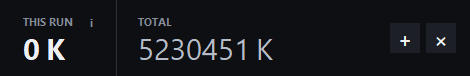
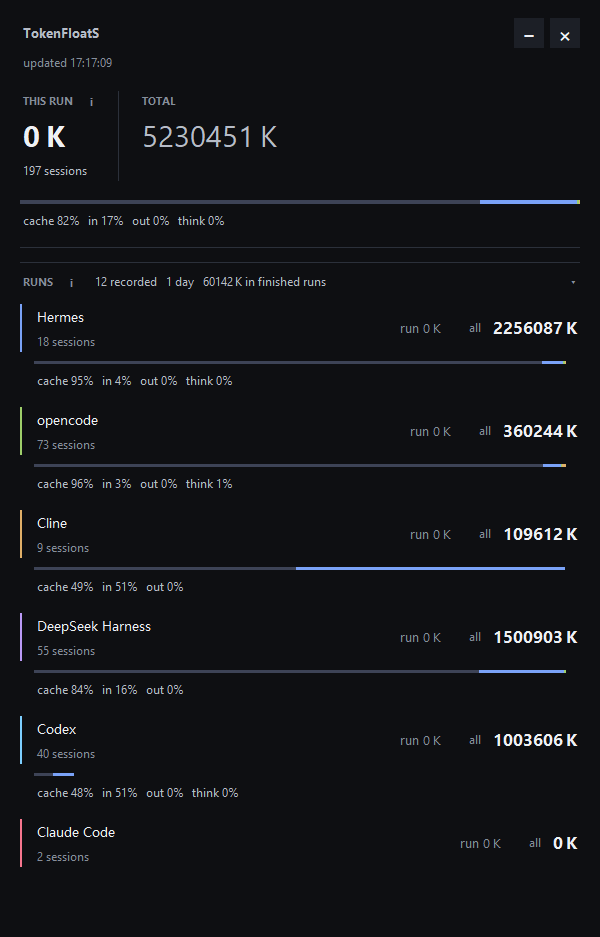
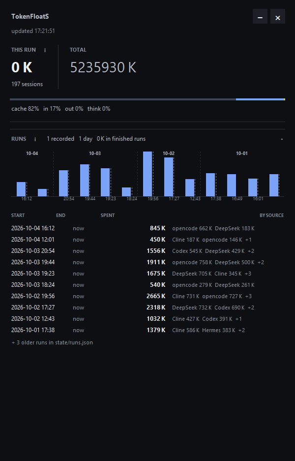

[English](README.md) | [中文](README.zh-CN.md)

# TokenFloatS

一个置顶浮窗，同时显示六个 AI 编程工具的实时 Token 用量：**Hermes、opencode、Cline、DeepSeek Harness、Codex、Claude Code**。

只读各工具的本地数据文件，**不发起任何网络请求**。查看用量不消耗 Token，也不会拖慢被监测的工具。



*折叠后的常驻窄条：`THIS RUN` 与 `TOTAL` 两个数字*



*展开后的完整面板：每个工具一行，含用量分布*



*运行记录：每次启动一根柱子，下方是记录明细。横向滚动图表可以查看更早的记录*

---

## 两个数字

| | 含义 |
|---|---|
| **`THIS RUN`** | 本次打开以来消耗的 Token。它是各工具当前累计值与启动时累计值之差，只统计新增用量，每次启动从 0 开始。 |
| **`TOTAL`** | 各工具自身的历史总量，直接读自它们的数据文件。 |

只有**你确实装了**的工具才会出现在面板里：装了两个就显示两行，不会出现几行红色报错。已安装但读取失败（结构变更、数据库损坏）仍会显示，因为那才是真正需要暴露的问题。

缓存读取通常约占总量的 80% 左右。每个工具下方有一条分布条，把它拆成 input、output、reasoning、cache read、cache write。

---

## 安装

需要一个 Python 3.10+。

```bash
git clone https://github.com/EphoReal/TokenFloatS
cd tokenfloats
python -m venv venv
venv\Scripts\pip install -r requirements.txt
```

## 运行

双击 `TokenFloatS.cmd`，不会出现黑窗口。

面板默认展开；点右上角的收缩按钮可折叠成上面的窄条，随时可以再展开。两种状态下都能拖动窗口，`Esc` 收起。

托盘图标右键：**显示面板 / 刷新 / 退出**。点关闭按钮只隐藏面板，不退出进程。

重复启动不会开出第二个实例，而是把已有面板唤到前台。

---

## 支持的工具

| 工具 | 读取位置 |
|---|---|
| Hermes | `%LOCALAPPDATA%\hermes\state.db`，表 `session_model_usage` |
| opencode | `~/.local/share/opencode/opencode.db`，表 `session_v2` |
| Cline | `~/.cline/data/sessions/*/*.json`，字段 `metadata.aggregateUsage` |
| DeepSeek Harness | `~/.dsh/storages/session_projcache`，字段 `rows.tokenUsage.val.totals` |
| Codex | `~/.codex/sessions/**/*.jsonl`，字段 `info.total_token_usage` |
| Claude Code | `~/.claude/projects/**/*.jsonl`，字段 `message.usage` |

仅覆盖上表列出的六个工具，不会自动探测、推断或适配其他 harness。

每个工具可能装在不止一个位置，所以每个源都有一组候选路径按顺序尝试，第一个存在的胜出。`config.json` 里的显式配置永远优先。

想确认某台机器上探测到了什么：

```bash
venv\Scripts\python.exe tokenfloats.py --detect
```

---

## 说明

- **只读**：所有数据库都以 `sqlite3.connect("file:...?mode=ro", uri=True)` 打开，绝不创建文件、不阻塞写入方。
- **单实例**：靠操作系统文件锁实现，强杀进程不会留下需要手动清理的残留。
- **可追溯**：每次启动会向 `state/runs.json` 追加一条带日期和时分的记录，含起止时间与各工具数字，最多保留最近 400 次。
- **诊断**：启动无控制台窗口，因此报错写入脚本同目录的 `tokenfloats.log`。
- **兼容性**：托盘面板仅支持 Windows（依赖 `pystray` 与 `pywin32`）；采集层是纯标准库，在 macOS / Linux 上也能运行。


## 运行记录

每次启动都会被记录，无论是正常退出还是中途关闭，所以记录不会漏掉任何一次。
每条记录保存起止时间、本次消耗，以及消耗来自哪些工具，存放在应用旁的
`state/runs.json`，上限为最近 400 条。

打开面板底部的运行记录，六个来源行会让位，换成一张柱状图和一份记录表格。
每根柱子代表一次启动，高度是它消耗的 Token 数，用的是面板中代表输入的同一种亮蓝；
带虚线边缘的是仍在进行中的本次运行。记录打开期间面板尺寸不变，屏幕上的任何内容都不会挪动。

## 许可证

MIT，见 [LICENSE](LICENSE)。

## 作者

- Xiaohongshu / Rednote：@Epho
- GitHub：https://github.com/EphoReal